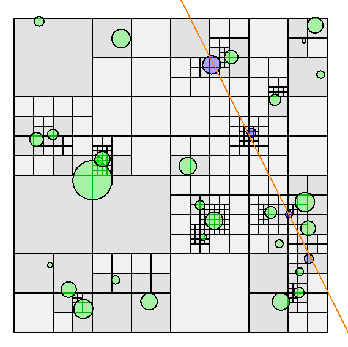

# Space Partitioning

Space partitioning algorithms in Rust. A work in progress.

## Implemented algorithms

### QuadTrees

Partitions 2D space into a tree of four segments each. Intersection tests are only
implemented using axis-aligned bounding boxes. The tree is currently implemented using
`i32` types only to speed up intersection tests; proper pre-scaling of floating-point data 
is therefore required.

The example showcases a ray-box test where a 2D ray is implemented using `f32`. It can
be started using

```console
$ cargo run --example quadtree
```



### Interval Trees

See [Interval Trees] on Wikipedia. 

```console
$ cargo run --example interval_tree
```

Usage example:

```rust
use space_partitioning::interval_tree::{IntervalTree, Interval, IntervalType};

#[derive(Debug, PartialOrd, PartialEq, Copy, Clone, Default)]
struct Vec2d {
    pub x: f64,
    pub y: f64,
}

impl IntervalType for Vec2d {}

fn main() {
    let tree = IntervalTree::from_iter([
        (
            Interval::new(Vec2d { x: 1., y: 2. }, Vec2d { x: 10., y: 10. }),
            "Any data (A)",
        ),
        (
            Interval::new(Vec2d { x: -5., y: -5. }, Vec2d { x: 5., y: 5. }),
            "Any data (B)",
        ),
        (
            Interval::new(Vec2d { x: -10., y: -10. }, Vec2d { x: -7., y: -7. }),
            "Any data (C)",
        ),
    ]);

    let test = Interval::new(Vec2d::default(), Vec2d::default());
    let result = tree.overlap_search(test).unwrap();

    assert_eq!(result.data, "Any data (B)")
}
```

[Interval Trees]: https://en.wikipedia.org/wiki/Interval_tree
